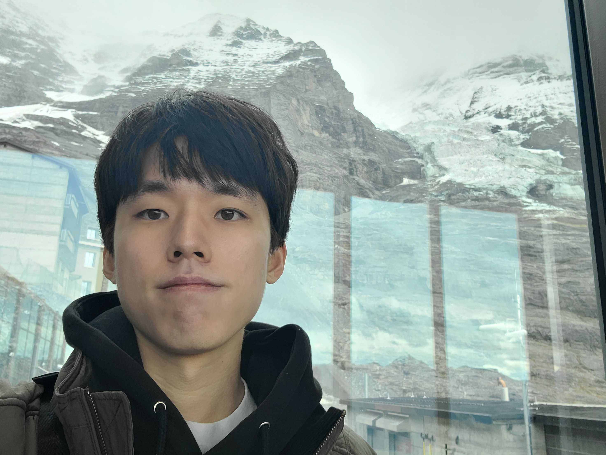

::: {.grid .bio-grid}

::: {.g-col-12 .g-col-md-8}
[윤창기 · TAMREF]{.bio-alias}

I am an incoming PhD student in the Department of Computer Science at the
University of Maryland, College Park, where I'm fortunate to be advised by
Prof. [MohammadTaghi Hajiaghayi](https://www.cs.umd.edu/~hajiagha/).
I received a B.Sc. from the Department of Mathematical Sciences at Seoul National University.

I am broadly interested in the design and analysis of algorithms and
combinatorics. Recently, I have been working on **graph algorithms** in parallel
and distributed settings, and LP-based approximation algorithms for
combinatorial optimization.

::: {.bio-links}
[Email](mailto:tamref.yun@snu.ac.kr) · [GitHub](https://github.com/TAMREF)
:::
:::

::: {.g-col-12 .g-col-md-4}
{.bio-photo fig-alt="Photo of Changki Yun"}
:::

:::

## News

::: {.news-list}
- [Sep 2026]{.news-date} I will join the University of Maryland as a PhD student.
- [Jul 2026]{.news-date} *Parallel Small Vertex Connectivity in Near-Linear
  Work and Polylogarithmic Depth* is accepted to **FOCS 2026**.
:::
